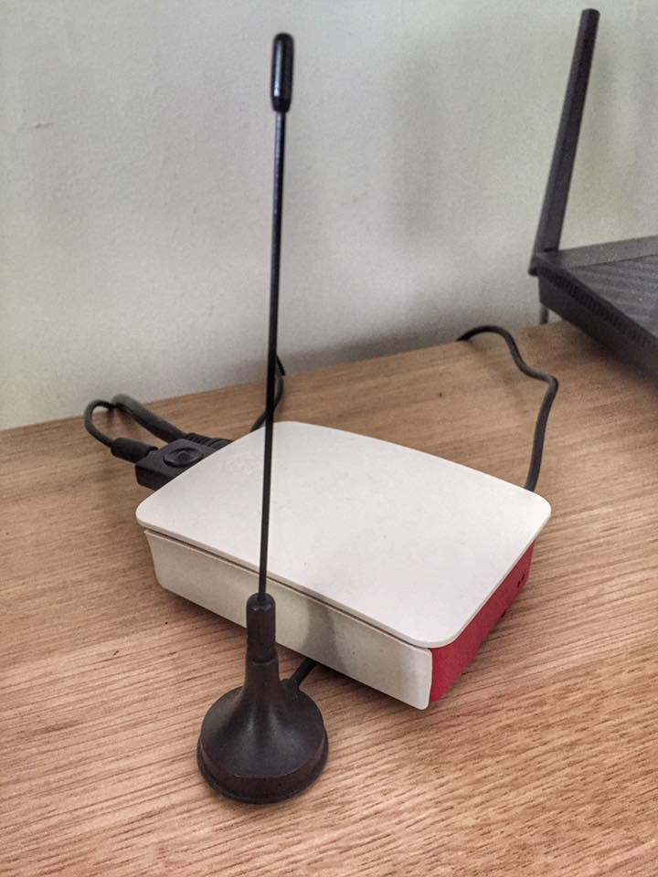
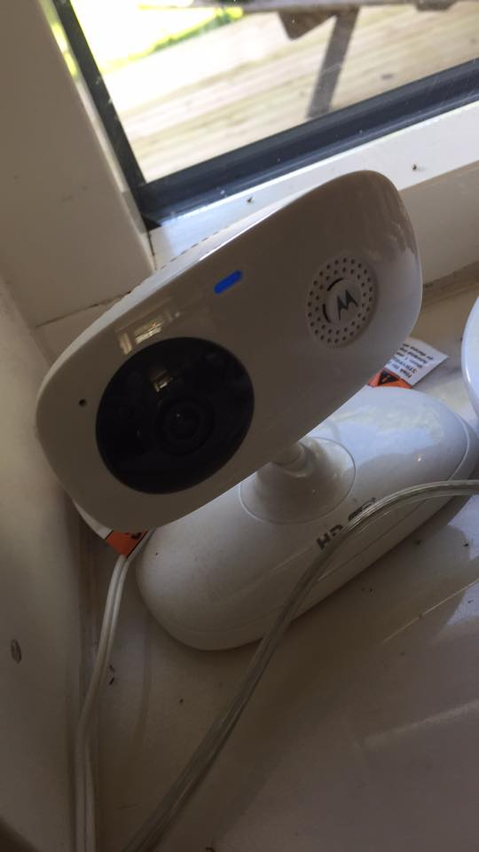
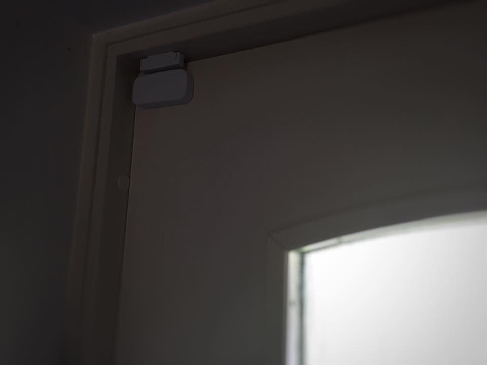
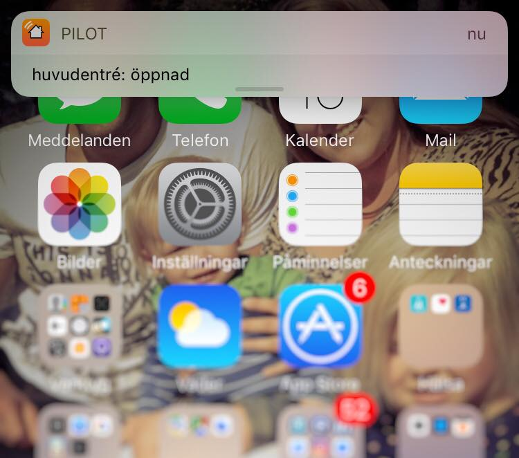
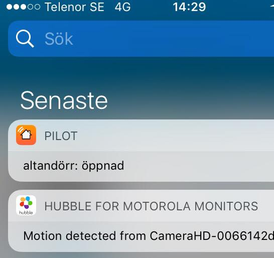
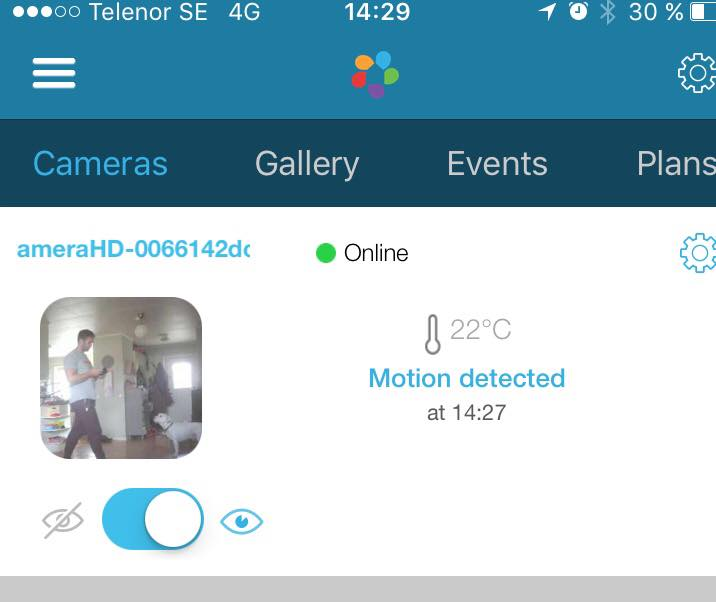

# Homealarm all-in-one-script-daemon

run by cron on my raspberry pi
```   
  * * * * * /home/pi/homealarm.pl --reset 2>&1 | tee -a /var/log/proc.homealarm.log
```
#### Dependencies:
*   rtl_433 (for tracking/monitor magnet- and movement- sensors )
*   hubbleconnect ( cloud service for controlling my motorola focus-66 ipcam )
*   pilot or prowl ( generating mobile push notice, using prowl atm )
*   asus router ( for geofencing mobile devices connected to my RT-AC66U )

I always check sensors, loggs all known events.<br>
I log unknown devices only once, to keep track whats emerging in the surrounding and when.<br>
Its very fascinating to see how much 433 devices we have around, even in the bush. :)<br>
When none of our phones are present after a minute we fire push notice and activate the shell protection state.<br>
If any sensor is triggered in this state we fire push notice and arm the ipcam, logging videos to the hubble cloud.<br>
If it has'nt recieved any radio events for over 5 minutes it will reset it self.<br>





